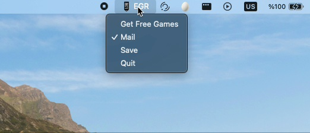

# EpicGames Free Games Alert

## Mail Sender app for weekly epicgames free games

**to make it work;**

- create an outlook account
- create a .credentials.json file
- add receivers email address

  schema of needed file:

  ```json
  {
    "EMAIL": "<your-outlook-account-email>",
    "PASSWORD": "<your-outlook-account-password>"
    "RECEIVERS": ["123@gmail.com","asd@gmail.com", "qwe456@hotmail.com"]
  }
  ```

**for test run (after complete previous step);**

```sh
~$ python -m unittest test_mail.py
```

**NOTE:**

- I use outlook because, we can not use gmail to send mail for free anymore. We need business account for create a mail sender bot (a.k.a: no unsecure apps anymore)

** mail example: <br>


** desktop app



